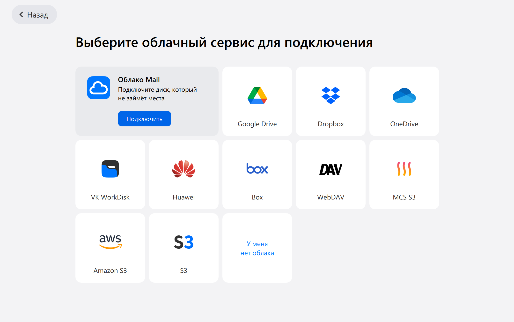
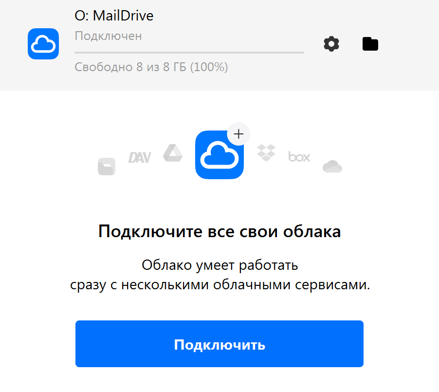
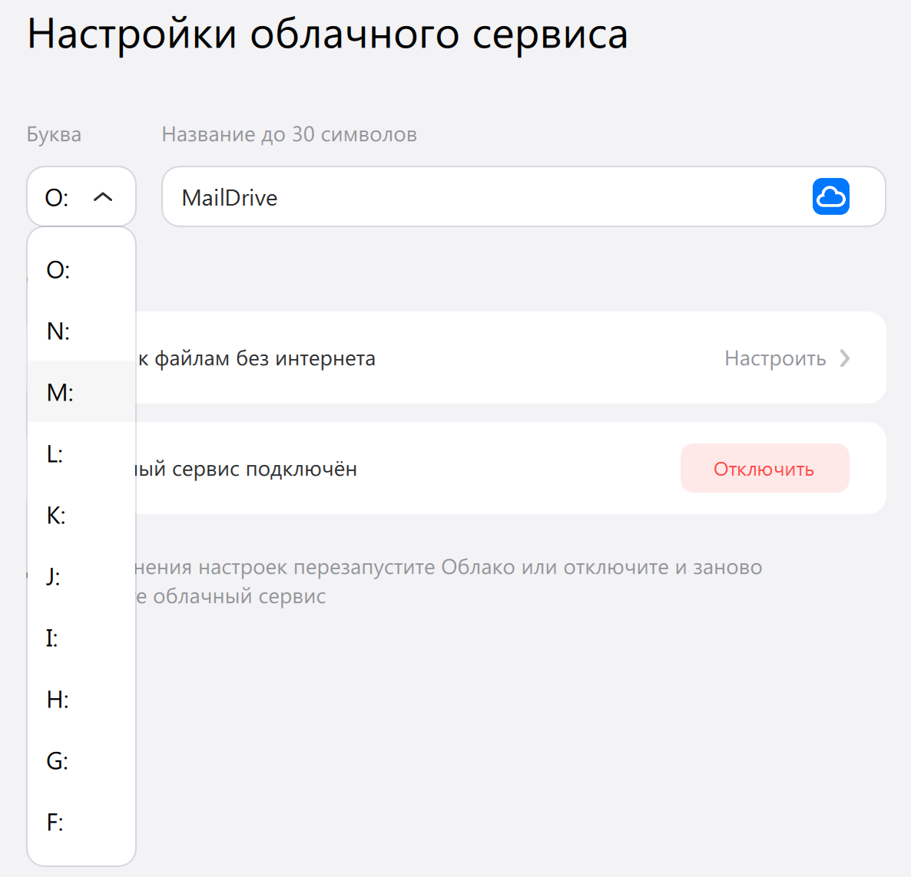

# Sync Mine World (v1.1)

Автоматизированная система синхронизации и хостинга локальных серверов Minecraft (Fabric) через **Mail Диск** и **Radmin VPN**.

Программа полностью берёт на себя всю рутину: скачивает актуальный сервер, проверяет версии Java на компьютере, динамически настраивает файлы запуска под лаунчер текущего игрока, создаёт резервные копии (бэкапы) и блокирует облако от одновременного запуска двумя игроками.

> ## Важная информация для создателя мира!
> Если вы хотите перенести ваш текущий развитый одиночный мир на эту серверную систему без потери построек и ресурсов, обязательно прочитайте **[гайд по переносу мира на сервер](SERVER_SETUP.md)**.


## Как установить и настроить Mail облако
1. Устанавливаем себе приложение **[Mail cloud](https://cloud.mail.ru/promo/desktop/)**
2. Жмём кнопку подключить, затем заходим в свой аккаунт и жмём "Подлючить" Облако Mail.

3. Попросить создателя общей папки с миром на диске добавить вас в редактора общей папки и скачать её себе на диск(Или сами создайте эту папку и добавьте туда друзей).
3. Откройте настройки облачного диска (шестерёнка в главном окне возле облачного диска)

5. Укажите для диска Mail **букву `M:`**.

6. Напротив **Доступ к файлам без интернета** нажмите **Настроить**.
7. Поставьте галочку напротив папки `Minecraft_shared` и закройте окно.

8. Немного подождите пока папка `Minecraft_shared` установиться и станет локальной.

## Как запустить

1. Перейдите в раздел **[Releases](../../releases)** на правой панели этой страницы.
2. Скачайте последнюю версию:
   * **`sync_mine_world.exe`** — если хотите запустить программу одним файлом.
   * **`sync_mine_world.zip`** — если ваш антивирус ругается на одиночный `.exe`. Просто распакуйте архив в любое место.
3. Убедитесь, что ваш Mail Диск включен и настроен **«Доступ к файлам без интернета»** для папки `Minecraft_shared`.
4. Запускайте утилиту и следуйте инструкциям на экране!!

## Сборка из исходников

Если вы хотите склонировать репозиторий и собрать `.exe` самостоятельно:

1. Склонируйте репозиторий и перейдите в папку проекта:
   ```bash
   git clone https://github.com
   cd sync_mine_world
   ```
2. Установите упаковщик `pyinstaller`:
   ```bash
   pip install pyinstaller
   ```
3. Запустите команду сборки (иконка `logo.ico` уже находится в папке):
   ```bash
   pyinstaller --clean --onefile --icon=logo.ico sync_mine_world.py
   ```
   *Или для сборки в режиме обычной папки (без флага `--onefile`), чтобы не триггерить антивирусы:*
   ```bash
   pyinstaller --clean --icon=logo.ico sync_mine_world.py
   ```
   Готовый результат забирайте в появившейся папке `dist/`.